# DRAFT

import { PostSection } from "components/PostSection"
import Demo from './demo'

<Demo props={props}>
  ### child
</Demo>

> ### hola
> 
> hola

Having a personal website establishes your online presence, it makes it easier for potential clients to find you and showcase your work and skills. 

No matter the subject of your expertise, optimizing your site to be an active platform for frequent publishing and updates requires some key and common issues to be addressed. Managing those issues if from what this post is about.

1. **Deploy a static site** with a **custom domain** using HTTPS protocol on **the edge** with a const-efficient method.

2. Functionality for an **email-delivery-sending** form.

3. **Automate deployments** to the site code and infrastructure by pushing new commits to a version control platform.

### Prerequisites

1. An **AWS** account

2. A **Github** account


### AWS Services, Version Control and CI/CD

### Whatever
<PostSection>
  xx
</PostSection>

Let's establish what **AWS services**, **version control** software and **[CI/CD](https://docs.aws.amazon.com/prescriptive-guidance/latest/strategy-cicd-litmus/understanding-cicd.html) tools** we will use from the **AWS console**, and briefly define them for further understanding.

#### IAM

**AWS Identity and Access Management (IAM)** allows you to control who can access your AWS services and what actions they can perform. This includes **Users**, **Groups**, **Roles** and more.

#### S3 (Simple Storage Service)

S3 is an object storage service provided by AWS. It allows you to store and retrieve data, such as files, images, and documents. It provides the option to store a static web site, which we will use in this walkthrough.

#### Route53

**Route 53** is designed to route internet traffic to web applications by translating user-friendly domain names into IP addresses. It allows you to register and manage domain names, making it a one-stop solution for both [DNS](https://aws.amazon.com/route53/what-is-dns/) management and domain registration.

#### Certificate Manager

**AWS Certificate Manager** seamlessly integrates with various AWS services, making it straightforward to enable secure connections and encrypt data for your web applications and infrastructure components. This will enable our site to use the HTTPS protocol, which is a feature that is *a must* for todays standards.

#### CloudFront

**Amazon CloudFront** is a [content delivery network (CDN)](https://aws.amazon.com/what-is/cdn/). It distributes content (such as web pages, images, videos, and other assets) to end-users with low latency and high data transfer speeds from edge locations around the world, reducing the load on the origin server and improving user experience.

#### SES (Simple Email Service)

**Amazon SES** enables you to send and receive emails using a scalable and cost-effective cloud-based infrastructure.

#### Lambda Functions

A **Lambda Function** allows you to run code in response to events without the need to manage servers. In this case, having a site a static (no server), makes a **Lambda Function** a great fit to build an email-sender interface to run on command.

#### API Gateway

**Amazon API Gateway** is a managed service that makes it easy for developers to create, publish, and manage [APIs](https://aws.amazon.com/what-is/api/). In our current use case it will serve as the communication between our website email-sending form and the **Lambda Function** that will trigger the **SES** request.

#### Github

**GitHub** is built on top of Git, a distributed version control system. It allows developers to track changes to their code over time, including who made the changes, what was changed, and when the changes were made, among multiple other features.

#### Github Actions

**GitHub Actions** is a an automation platform provided by **GitHub** that allows developers to automate various aspects of the software development lifecycle. It allows you to create workflows that are defined in a YAML file within your repository. In this article we will trigger updates to our infrastructure when commits are pushed to **GitHub**.

## Kickstart your frontend

All the steps to come can be followed along using any type of frontend approach, but just for explanatory purposes and due to its popularity I'll be moving forward with [Next.js](https://nextjs.org/docs), which the tool I've used to build [this site](https://github.com/macedomauriz/me). 

A vanilla HTML/CSS/JS approach or any other static site generator will also work, choose your own. 

The only time your frontend might slightly diverge from a following step is in the writing of the client function that will send the `POST` request for the email to be send.

[Make a Github repository](https://docs.github.com/en/get-started/quickstart/create-a-repo) and push your code.

## Deploy your code to AWS S3

As a Node.js-based project, Next.js, being [React](https://react.dev/) library, relies on a `package.json` file to handle dependencies and scripts. To generate the code that you'll upload to an S3 bucket, simply execute the build script defined in your `package.json` by running `npm run build` in your terminal.

```json:package.json {5} showLineNumbers
{
	"private": true,
	"scripts": {
	"dev": "next dev",
	"build": "next build",
	"postbuild": "next-sitemap",
	"start": "next start",
	"lint": "next lint"
},
"dependencies": {
...
```

As a result, a folder named `out` will be created, this is the [SGG](https://nextjs.org/docs/pages/building-your-application/rendering/static-site-generation) output that must be uploaded to S3. If you chose another tool such as [Vue](https://vuejs.org/) or [Svelte](https://svelte.dev/), this folder can be named `dist` or `public`. If your approach is vanilla, the files you've written are enough to be served.

It is recommended not not use the root user for everyday tasks, so to follow basic best practices create a **User** to follow along if you don't have one already.

Create two buckets and fill in the **Bucket name** input as the domains they will receive traffic from, one for the www version, the other for the non-www version.

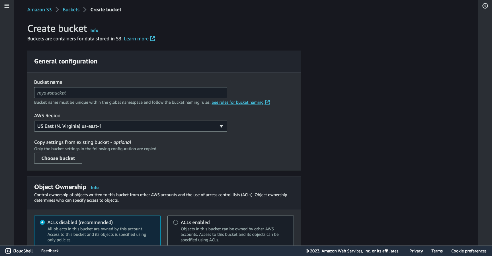

For my site I made one named `www.macedomauriz.com` and another named `macedomauriz.com`. 

You can pick which URL will be the main one and which one will redirect the traffic to the other. In this case I picked the non-www to be the preferred one.

#### Bucket #1: Preferred version (non-www)

Click the created bucket and go to **Objects** tab, click **Upload**, and to put your site files into the bucket.

After uploading your files go to the **Permissions** tab and edit the ****Block public access (bucket settings).****

You will find the public access blocked as shown below, uncheck the **Block all public access** option.

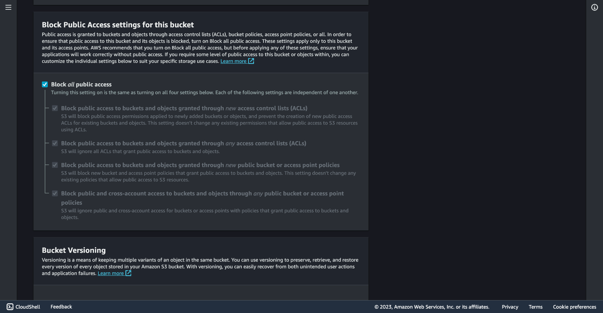

Now you can add a bucket policy to actually grant **public read access** to your bucket. 

In the current **Permissions** tab and under **Bucket Policy** click **Edit** and add the following JSON.

```json:package.json showLineNumbers
{
  "Version": "2012-10-17",
  "Statement": [
    {
      "Effect": "Allow",
      "Principal": "*",
      "Action": [
        "s3:GetObject"
      ],
      "Resource": [
        "arn:aws:s3:::<BUCKET-NAME>/*"
      ]
    }
  ]
}
```

Let's break down the different elements of this policy statement:

1. `"Version": "2012-10-17"`: This specifies the version of the policy language being used. In this case, it's using the 2012-10-17 version.
2. `"Statement"`: This is an array that contains one or more individual policy statements. In this example, there's only one statement
3. `"Effect": "Allow"`: This specifies the effect of the statement, which, in this case, is "Allow." This means that the policy grants permissions rather than denying them.
4. `"Principal": "*"`: The `"Principal"` is who the policy applies to. In this statement, the asterisk (`*`) indicates that this policy applies to any AWS identity (i.e., any user or service). Essentially, it allows public access to the specified resources.
5. `"Action": ["s3:GetObject"]`: This lists the AWS actions that are allowed. In this case, it allows the `"s3:GetObject"` action, which permits users to retrieve or download objects from the specified **S3** bucket.
6. `"Resource": ["arn:aws:s3:::<BUCKET-NAME>/*"]`: This specifies the AWS resources to which the policy applies. The `"arn"` (Amazon Resource Name) is a unique identifier for AWS resources. In this statement, it allows the `"s3:GetObject"` action on any object (`"/*"`) within the specified S3 bucket, which is denoted as `"arn:aws:s3:::<BUCKET-NAME>/*"`. You would replace `<BUCKET-NAME>` with the actual name of the S3 bucket.

Now with public access your bucket will be able to serve your website. Go to the ****Properties**** tab, at the bottom you'll find the ****Static website hosting**** section, click **Edit** and **Enable** **Static website hosting.** 

For the **Index document** and **Error document** inputs, fill them in as the screenshot below, if you generated your site with a different tool, or got plain HTML files, this values might change.

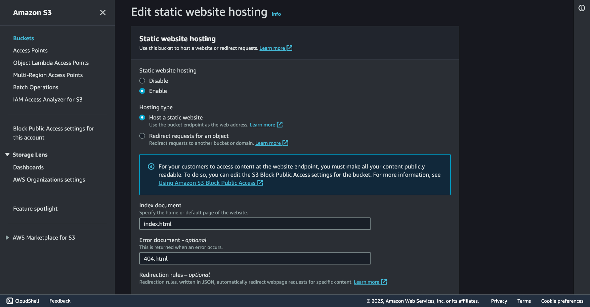

Once you saved changes the endpoint serving the site can be found under this same ****Properties**** tab, under ****Static website hosting**** at the bottom of the page. 

💡 **Important**: Keep this URL to use later on in the **CloudFront** section. With it you can already see your site running in the browser.

#### Bucket #2: Redirect version (www)

Go to your second bucket and click the ****Properties**** tab, at the bottom you'll find the ****Static website hosting**** section, click **Edit** and enable **Static website hosting.** 

This one will redirect to the non-www as we decided at the beginning, select **Redirect request for an object** checkbox and put the non-www domain in the **Host name** input, you will use this domain name in the Route 53 and CloudFront sections, mine is [macedomauriz.com](http://macedomauriz.com) (as the first bucket was named).

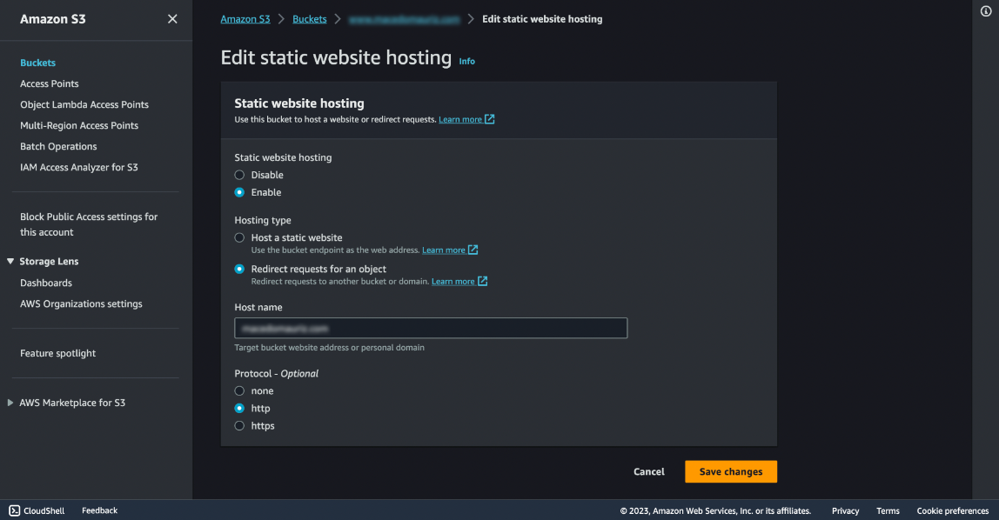

## Set up a domain in Route 53

In **Route 53**, choose **Domains** and then **Registered domains,** go to **Register domains** and follow the instructions to get the one of your choice. 

Keep in mind that if you have a domain you'd like to use in another registrar, you can [transfer it to Route 53](https://docs.aws.amazon.com/Route53/latest/DeveloperGuide/domain-transfer.html) or just use the service you already have your domain registered into.

Other alternatives like GoDaddy, HostGator, Namecheap or other similar registrars will work just fine.

## Request a SSL Certificate

To get the SSL certificate and be able to deliver your site with the HTTPS protocol, go to **Certificate Manager**, **Request Certificate,** and add the www version and non-www version of your domain.

Pick the **DNS Validation** method, you'll get a **CNAME Name** and **CNAME Value** to add in a **CNAME type** your Route 53 DNS manager. 

<blockquote>

⚠️  Your **CNAME Name** might looks something like this:

non-www: `_74c710c8ea9fd3d3a123f4cbeb06025c.<domain>.`

www: `_cty6f8f9b69x5bc0e00e56a3e91bf123.www.<domain>.`

</blockquote>

Be sure to remove the `<domain>` part when pasting it the DNS manager inputs.

The verification might take a while, be patient.

## Set up CloudFront as a CDN

Once you have your buckets set and your domain certified, let’s configure CloudFront. 

**CloudFront** can act as an SSL/TLS termination point for your web traffic, you can configure it to use SSL certificates (previous step) to encrypt the connection between end users and the CloudFront edge locations with our bucket content.

> *As of July 2023, Amazon CloudFront uses a global network of 450+ Points of Presence and 13 regional edge caches in 90+ cities across 49 countries to deliver content to end users with lower latency. Amazon CloudFront Edge locations are located in the following areas*
>

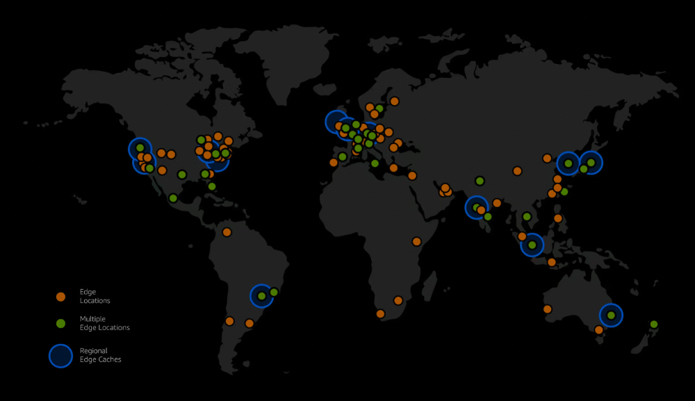

Go to AWS CloudFront service and click Create Distribution. In the Origin domain input paste the URL copied from the Bucket #1 section inside the Properties tab (do not pick a URL from the dropdown).

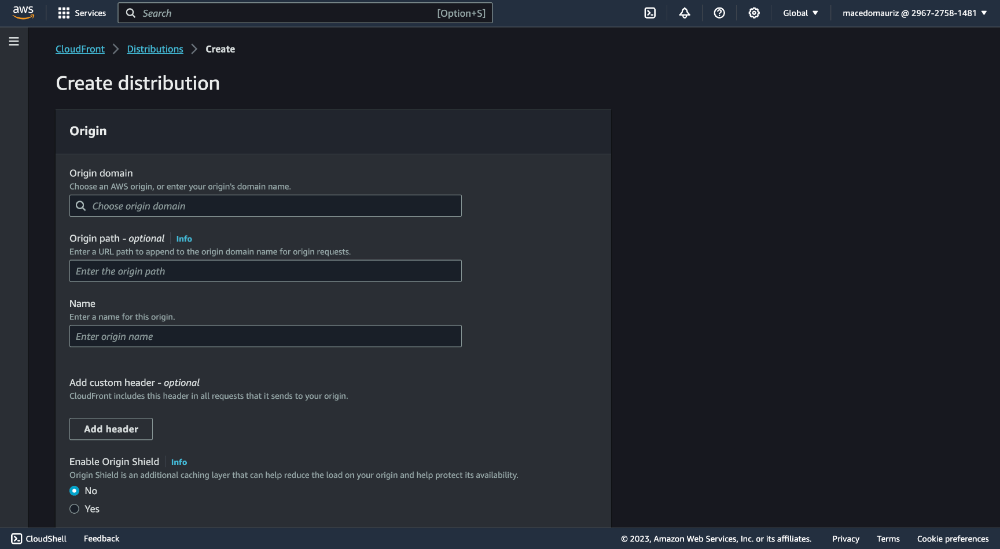

Scroll down and find the **Viewer protocol policy** section and check **Redirect HTTP to HTTPS**.
Scroll down to **Settings** and fill in the **Alternate domain name (CNAME) *- optional* input with the non-www and the www versions of your domain.
In **Custom SSL certificate *- optional*** pick your SSL certificate created in the previous step, and in **Default root object *- optional*** put `index.html`.

With all set, click **Create distribution**.

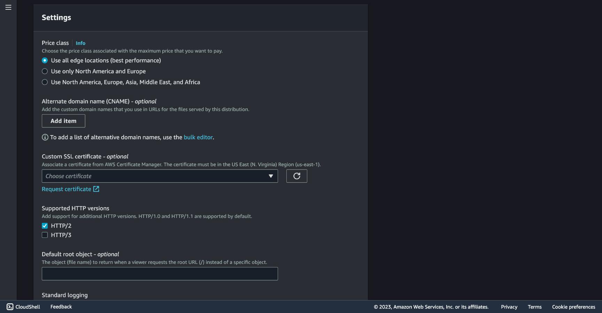

Once created, enter your new Distribution and under the **General** tab find the URL under **Distribution domain name**. With this URL you can now visit your bucket-hosted website now under HTTPS protocol.

Let's set up our domain instead of this URL with one and simple step. Go to **Route 53** and create a new Record in the DNS management section, put **CNAME i**n the Type input, `@` in the Host and your Distribution URL as the Value.

At this point the **S3** stored website must be available from the **CloudFront** edge locations in HTTPS for the non-www domain version with redirection from the www one.

## SES email verification

Emails should be set from an address, so let's tell **SES** that we own the email address we will use.

Go to **SES** and in the left panel select **Verified Identities** and click **Create identity**. Pick **Email address** for the method of verification, in the **Email address** input, write your email. You will receive a message from `no-reply-aws@amazon.com` for you to verify.

To ask **SES** to send an email for us we will need a function to process that request, and to connect to that function we will need an API to talk to that function from our webpage email-sending form.

## Write a Lambda Function

Before writing the function, first we need to attach a [Policy to the Role that will give the Permission](https://docs.aws.amazon.com/IAM/latest/UserGuide/access_policies.html) to our **Lambda** to do what we require.

Go to **IAM (Identity and Access Management)** and select **Roles**, name **create a **Role**, click the dropdown menu for **Add permissions** and select **Attach policies**, pick **AmazonSESFullAccess**.

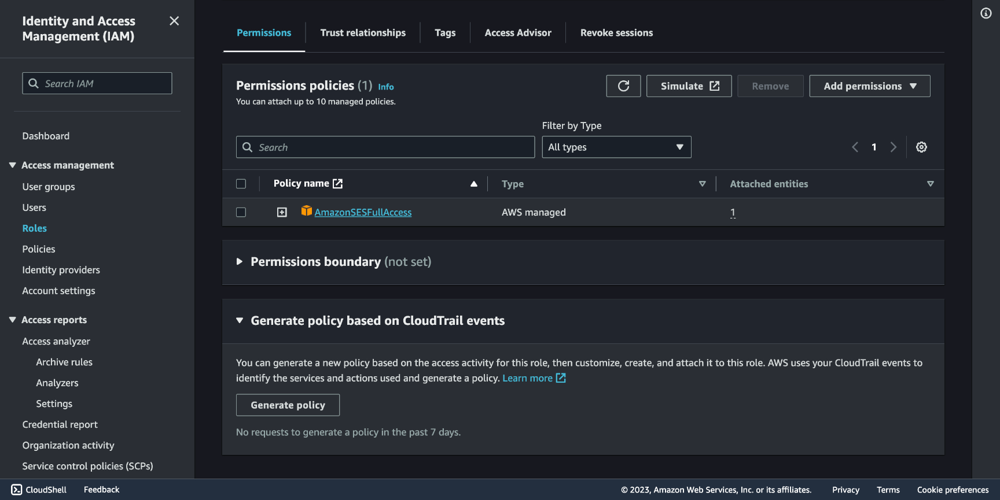

Now that we have a **Role** to use, let's create a function. Go to **AWS Lambda** and click **Create function**. Pick **Author from scratch** checkbox.

Name the function and select a runtime of your choice, in this example we'll go with Python 3.9. Under **Permissions select Use existing role** and pick the one we created, which will allow our function to work with SES under the **AmazonSESFullAccess** policy.

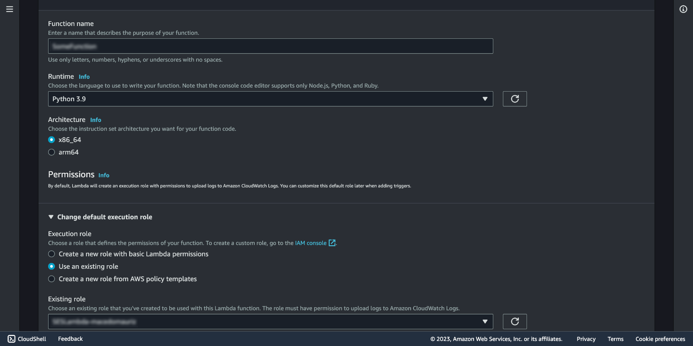

Let's create a function that gets triggered by a request from our website through the API Gateway and sends an email using the email we set up in SES.

```python:your-lambda-function.py showLineNumbers
# This line imports the AWS SDK for Python (Boto3), which allows you to interact with AWS services.
import boto3
# The json module is imported to work with JSON data.
import json


# This is the main entry point for your AWS Lambda function. 
# It receives two parameters, event and context. The event parameter contains information about the incoming request.
def lambda_handler(event, context):
	# This line creates an SES (Simple Email Service) client using Boto3. The client will be used to send the email.
    client = boto3.client("ses")
	# This parses the JSON data in the body field of the event parameter.
    event_body = json.loads(event["body"])
    my_email = "<your-email>"

	# Extract the subject, body, and email address from the parsed JSON data and assigns them to variables.
    subject = event_body["subject"]
    body = event_body["body"]
    email = event_body["email"]

	# The email message is constructed in a format suitable for SES using a dictionary.
	# message is a dictionary with two keys, "Subject" and "Body."
    message = {"Subject": {"Data": subject}, "Body": {"Html": {"Data": body}}}
	# Send the email using the SES client.
    response = client.send_email(
        Source=my_email, Destination={"ToAddresses": [my_email, email]}, Message=message
    )
	# The Lambda function returns the response from the SES email sending operation. 
	# This response may contain information about the email's status, 
	# including whether it was successfully sent or any errors encountered during the process.
    return response
```

## Create an API Gateway

**AWS Lambda** functions are event-driven, which means they don't have a built-in HTTP interface. An **API Gateway** acts as an HTTP endpoint that allows you to trigger Lambda functions via HTTP requests. This makes it possible to expose serverless functions as API endpoints. Let's make one.

Go to **API Gateway** and click **Create API**, and choose HTTP API.

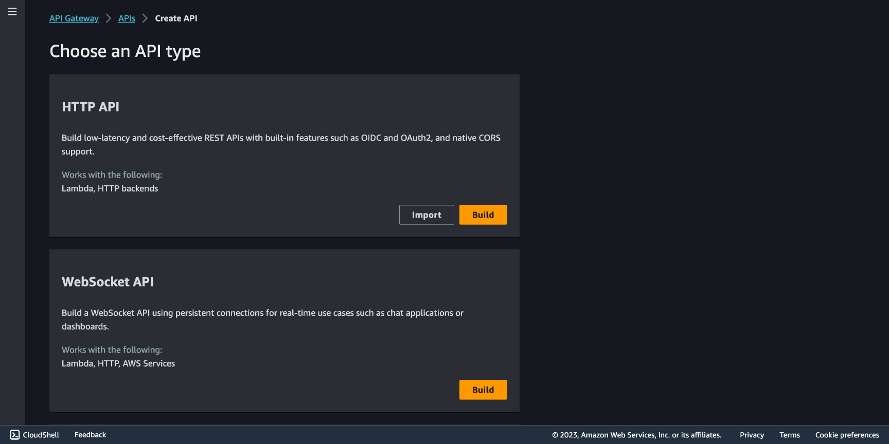

Choose Add integration and configure it to use our Lambda Function, then choose an API name.

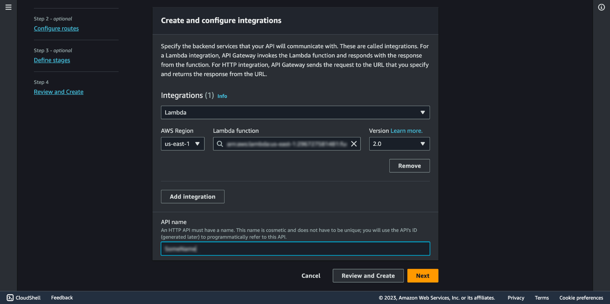

We will need a route to connect, you can choose /set , and in Integration target go with your Lambda Function.

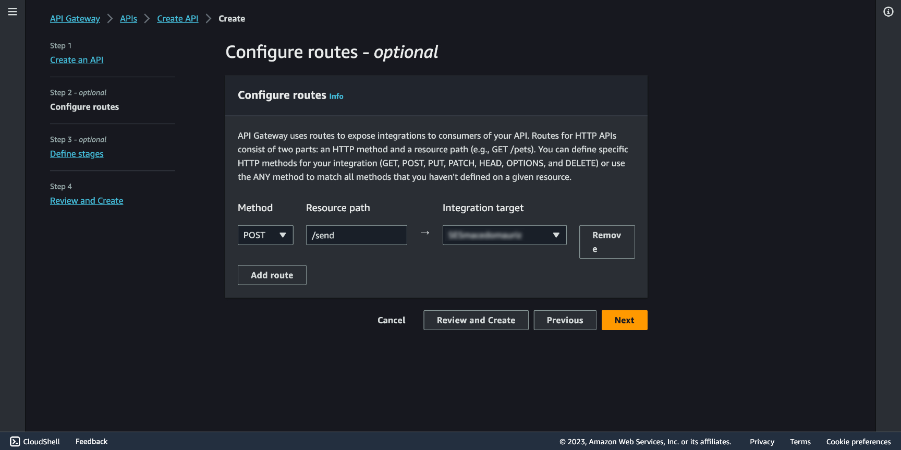

Then you will be asked to create a **Stage**. From AWS:

> ⚠️ *Stages are independently configurable environments that your API can be deployed to. You must deploy to a stage for API configuration changes to take effect, unless that stage is configured to autodeploy. By default, all HTTP APIs created through the console have a default stage named $default. All changes that you make to your API are autodeployed to that stage. You can add stages that represent environments such as development or production.*

Let's go with the default autodeploy, click **Next**.

After your API is created you'll be able to see in the **Integrations** section in the left side menu the relation of your API `/send` endpoint and your **Lambda Function**.

Let's modify the CORS configuration. CORS, which stands for Cross-Origin Resource Sharing, is a security feature implemented by web browsers to control and manage requests made to resources (e.g., web APIs) on different domains or origins. It is a security measure designed to protect web applications from potentially malicious cross-origin HTTP requests.

`Access-Control-Allow-Origin`: The origin from when your requests will come from (the domain).

`Access-Control-Allow-Headers`: Choose `content-type`.

`Access-Control-Allow-Methods`: Chose `POST`.

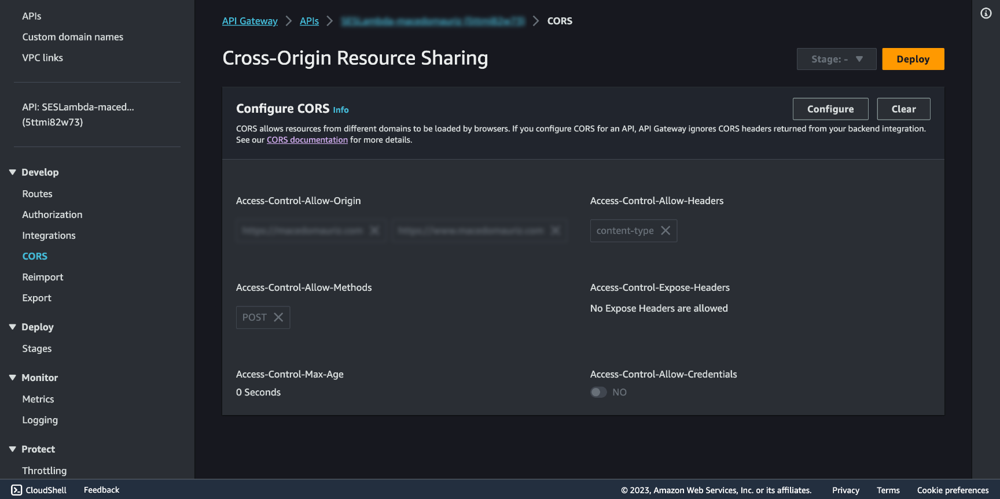

To get the URL to use making the POST request from our form, go to Stages and find it below Invoke URL, we picked the route /send , so we'll use `<Invoke-URL>/send`.

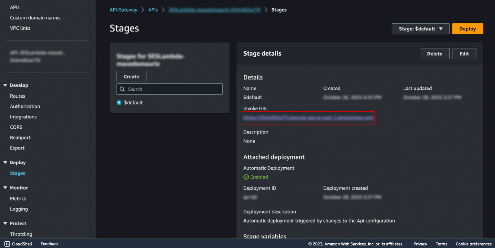

## Make a Form

Make a UI for the mail to be composed, a `form` that accepts a `name`, `company` and `body` inputs for it to be able to be processed by the **Lambda Function**.

As our example is a React application, your request functionality may look something like the code below. Our infrastructure set up is frontend agnostic though, write your function for the approach you've chosen. 

Let's move forward, and see a React function example.

```javascript:fetch.ts showLineNumbers
// Function to be called when clicking SEND in the UI button.
const fetchData = (data: GetInTouchProps) => {
		// The fetch function is used to make an HTTP POST request to the specified API Gateway URL.
    fetch("<API-Gateway-URL>", {
      method: "POST",
			// The headers property specifies that the content being sent in the request body is in JSON format. 
			// This is indicated by setting the "Content-Type" header to "application/json."
      headers: {
        "Content-Type": "application/json",
      },
			// The request body is constructed using JSON.stringify(). 
			// It includes HTML and plain text data as properties within an object. 
			// The data sent in the request body includes an HTML message as body, a subject, and an email address. 
			// The data is constructed using values from the data object, which represents users input.
      body: JSON.stringify({
        body: `
          <p>Name: ${data.name}</p>
          <p>Company: ${data.company}</p>
          <p>Email: ${data.email}</p>
          <p>Message: ${data.body}</p>
        `,
        subject: `${data.name} from ${data.company}`,
        email: data.email,
      }),
    })
      .then(response => response.json())
      .then(data => {
        // data processing
      })
      .catch(() => {
        // error handling
      })
  }
```

Go and push your request form to your **Github** repository. 

Now we have a **UI** to send a **JSON request** through an **API Gateway** that connects to a **Lambda Function** that triggers an email to be sent through **SES**.

Let's automate this setup.

## CI/CD

#### Identity provider - OIDC (OpenID Connect)

Up until a few years ago, you would need **user secret access keys** to connect programmatically to third party services such as **Github**, this means, configuring the external application to perform actions authenticated as an IAM user.

These long-lived access keys, can be a security risk if they are compromised or mishandled. They can lead to unauthorized access to AWS resources and also can be hard to manage in the long run.

Today, short-term credentials generated via **OpenID Connect** offers enhanced security as they have a limited lifetime and can be rotated automatically.

Let's use this to establish a trust relationship between **AWS** and **Github** OIDC provider.

Go to **IAM Identity providers** and click **Add provider** and check **OpenID Connect**. In the **Provider URL** input add `https://token.actions.githubusercontent.com` and click **Get thumbprint.** In **Audience** fill in with ****`sts.amazonaws.com` and click **Add provider**.

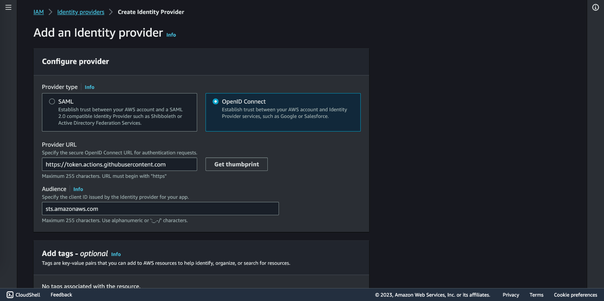

Now a Role must be created. Go to IAM Roles. Check Web identity and in Identity provider you will find the one you set before. in Audience select the one created in the prior step, in GitHub organization select your Github account name, in GitHub repository the actual name of the repository your code is deployed to, and in GitHub branch select master (or main).

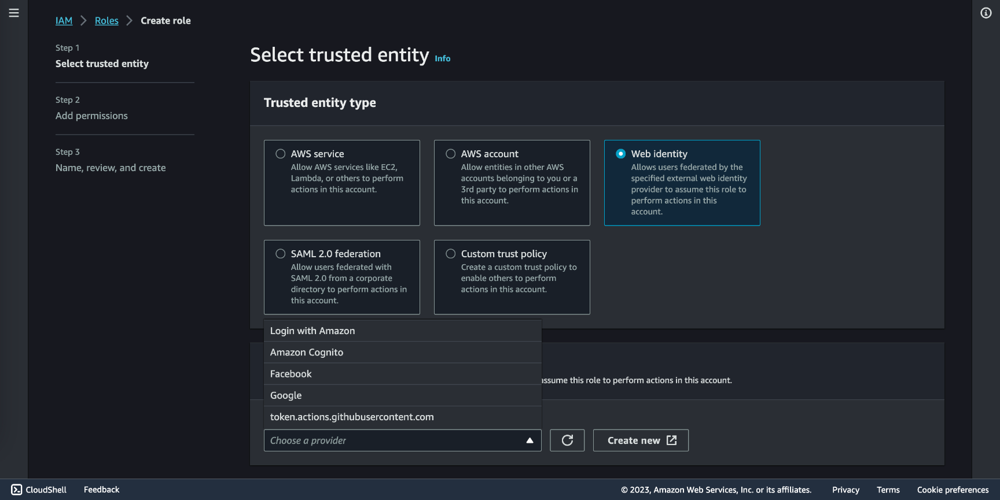

Once created, go to IAM Roles and select the one created. Go to the Trust relationship tab, you'll see the result of the configuration in a JSON format similar to this:

```json showLineNumbers
{
  "Version": "2012-10-17",
  "Statement": [
    {
      "Effect": "Allow",
      "Principal": {
        "Federated": "arn:aws:iam::<AWS-ACCOUNT-ID>:oidc-provider/token.actions.githubusercontent.com"
      },
      "Action": "sts:AssumeRoleWithWebIdentity",
      "Condition": {
      "StringEquals": {
        "token.actions.githubusercontent.com:aud": "sts.amazonaws.com",
        "token.actions.githubusercontent.com:sub": "repo:<GITHUB-ACCOUNT>/<GITHUB-REPO>:ref:refs/heads/<GITHUB-BRANCH>"
       }
     }
    }
  ]
}
```

In the Role ****Summary**** section you will find a role ARN (Amazon Resource Name) in the format of `arn:aws:iam::<AWS-ACCOUNT-NUMBER>:role/<ROLE-NAME>`, copy it and go to `https://github.com/<GITHUB-ACCOUNT>/GITHUB-REPO>/settings/secrets/actions`, make a **New repository secret** and save your `ARN` as `AWS_ROLE_ARN`.

Now that we have a trust relationship established, we need to set the permissions of that relationship. In the **Permissions** tab click **Add permissions > Create inline policy**.

```json showLineNumbers
{
	"Version": "2012-10-17",
	"Statement": [
		{
			"Effect": "Allow",
			"Action": [
				"s3:*"
			],
			"Resource": [
				"arn:aws:s3:::<BUCKET1-NAME>",
				"arn:aws:s3:::<BUCKET1-NAME>/*"
			]
		}
	]
}
```

Let's break down the policy statements we haven't used so far:

- `"Action"`: In this statement, **`"s3:*"`** is used, which is a wildcard that allows all S3 actions. This means that the entity associated with this policy is granted permission to perform any action on the specified S3 resource.
- `"Resource"`: This is an array that specifies the AWS resources to which the permissions apply. In this statement, two ARNs (Amazon Resource Names) are specified:
    - `"arn:aws:s3:::<BUCKET1-NAME>"`: This ARN represents the S3 bucket itself, indicating that the permissions granted by this statement apply to the bucket named "macedomauriz.com."
    - `"arn:aws:s3:::<BUCKET1-NAME>/*"`: This ARN represents all objects within the "macedomauriz.com" bucket. The **`/*`** at the end of the ARN allows actions on all objects within the bucket.

Le'ts create another inline policy.

```json showLineNumbers
{
	"Version": "2012-10-17",
	"Statement": [
		{
			"Effect": "Allow",
			"Action": [
				"cloudfront:CreateInvalidation"
			],
			"Resource": "arn:aws:cloudfront::<ACCOUNT-ID>:distribution/<DISTRIBUTION-ID>"
		}
	]
}
```

- `"Action"`: The action is `"cloudfront:CreateInvalidation"` which allows the creation of a CloudFront invalidation request. An Amazon CloudFront invalidation request is a mechanism for removing or invalidating cached content from Amazon CloudFront's content delivery network (CDN) edge locations. Invalidating content is necessary when you want to ensure that the most up-to-date or correct content is served from the CDN.
- `"Resource"`: This specifies the AWS resource to which the permission applies. In this statement, it is defined as an Amazon Resource Name (ARN):
    - `"arn:aws:cloudfront::<ACCOUNT-ID>:distribution/<DISTRIBUTION-ID>"`: This ARN represents a specific CloudFront distribution. You need to replace `<ACCOUNT-ID>` with your AWS account ID and `<DISTRIBUTION-ID>` with the ID of the CloudFront distribution to which this policy applies.

And one last policy.

```json showLineNumbers
{
	"Version": "2012-10-17",
	"Statement": [
		{
			"Effect": "Allow",
			"Action": "lambda:*",
			"Resource": "arn:aws:lambda:<AWS-REGION>:<AWS-ACCOUNT-ID>:function:<LAMBDA-NAME>"
		}
	]
}
```

- `"Action": "lambda:*"`: The `"lambda:*"` wildcard allows all Lambda actions, meaning the policy permits all operations on AWS Lambda.
- `"Resource": "arn:aws:lambda:<AWS-REGION>:<AWS-ACCOUNT-ID>:function:<LAMBDA-NAME>"`: This attribute defines the AWS resource to which the policy applies. It uses an Amazon Resource Name (ARN) to specify the AWS Lambda function to which this policy grants permissions. You should replace `<AWS-REGION>`, `<AWS-ACCOUNT-ID>`, and `<LAMBDA-NAME>` with your specific values.

#### Automate deploys to S3 with Github Actions

In your code, from the root, make a `.github` folder and inside it a `workflows` folder, then create a `.yaml` file with a name of your choice, let's call it `build-deploy.yaml`.

Let's go through the the instructions for **GitHub Actions**.


```yaml showLineNumbers
name: Deploy static site to S3

# The workflow is triggered by a push event to the master branch.
on:
	push:
		branches: [master]

env:
	REGION: <YOUR-REGION>
	BUCKET: <YOUR-BUCKET-NAME>
	# This can vary depending in your frontend as explained before
	OUT: out
	DIST_ID: <YOUR-CLOUDFRONT-DISTRIBUTION>

# Permission can be added at job level or workflow level.
permissions:
	id-token: write # This is required for requesting the JWT.
	contents: read # This is required for actions/checkout.

jobs:
	DeployS3-CloudFrontInvalidation:
		# This job is configured to run on an ubuntu-latest runner (virtual machine) provided by GitHub.
		runs-on: ubuntu-latest
		steps:
			# This step checks out the source code of your GitHub repository to access your project files.
			- name: Git clone the repository
			uses: actions/checkout@v3

			# This step certifies AWS credentials to move forward with the job
			- name: Configure aws credentials
	    uses: aws-actions/configure-aws-credentials@v1.7.0
	    with:
	      role-to-assume: ${{ secrets.AWS_ROLE }}
	      role-session-name: GitHub_to_AWS_via_FederatedOIDC
	      aws-region: ${{ env.REGION }}

			# If you made the decistion to build your frontend in a Node-based tool
			# You will need npm to install all the dependencies and build the output folder (out in this case)
			# Install dependencies and Build steps perform this process, but if its pure HTML/CSS/JS you do not need this.
		  - name: Install dependencies
		    run: |
			    node --version
			      npm ci

		  - name: Build
		    run: npm run build

			# Use the AWS CLI to delete old content of your bucket and update it with the new pushed code.
		  - name: Copy files to production with AWS CLI
		    run: |
		      aws s3 sync --delete ${{ env.OUT }} s3://${{ env.BUCKET }}

			# Reset cached content from CloudFront.
		  - name: Create CloudFront Invalidation
		    run: |
		      aws cloudfront create-invalidation \\
		        --distribution-id ${{ env.DIST_ID }} \\
		        --paths "/*"
```

Make a new push and go to `https://github.com/<GITHUB-ACCOUNT>/<GITHUB-REPO>/actions` your should see your action going.

#### Update Lambda Function with Github Actions

It would be a good idea to modify our **Lambda Function** from our code editor and update it without having to go to AWS, also it comes with the advantage of using the code formatting and linting you have running locally, plus, I prefer to have a version control of the changes the function had in the same place as the site code itself. So let's go for it.

Make a new `.yaml` file with the following code.

```yaml showLineNumbers
name: Deploy Lambda function from source

on:
  push:
    branches:
      - master

env:
  REGION: <YOUR-REGION>

permissions:
  id-token: write
  contents: read

jobs:
  Deploy-LambdaFunction:
    runs-on: ubuntu-latest
    steps:
      - name: Git clone the repository
        uses: actions/checkout@v3

      - name: Configure aws credentials
        uses: aws-actions/configure-aws-credentials@v1.7.0
        with:
          role-to-assume: ${{ secrets.AWS_ROLE }}
          role-session-name: GitHub_to_AWS_via_FederatedOIDC
          aws-region: ${{ env.REGION }}

			# This step uses the appleboy/lambda-action to deploy a Lambda function. 
			# It is configured with several input parameters.
      - name: Deploy Lambda function
        uses: appleboy/lambda-action@v0.1.9
        with:
          aws_region: ${{ secrets.REGION }}
          function_name: <LAMBDA-NAME>
          source: <LAMBDA-CODE-ROUTE>
```

Again, make a new push and go to `https://github.com/<GITHUB-ACCOUNT>/<GITHUB-REPO>/actions` and your should see both workflows going.
